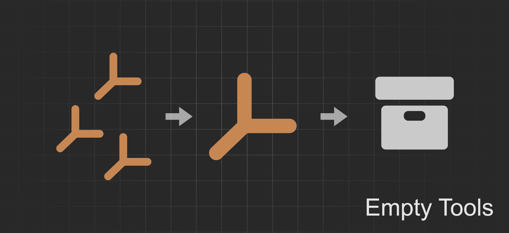
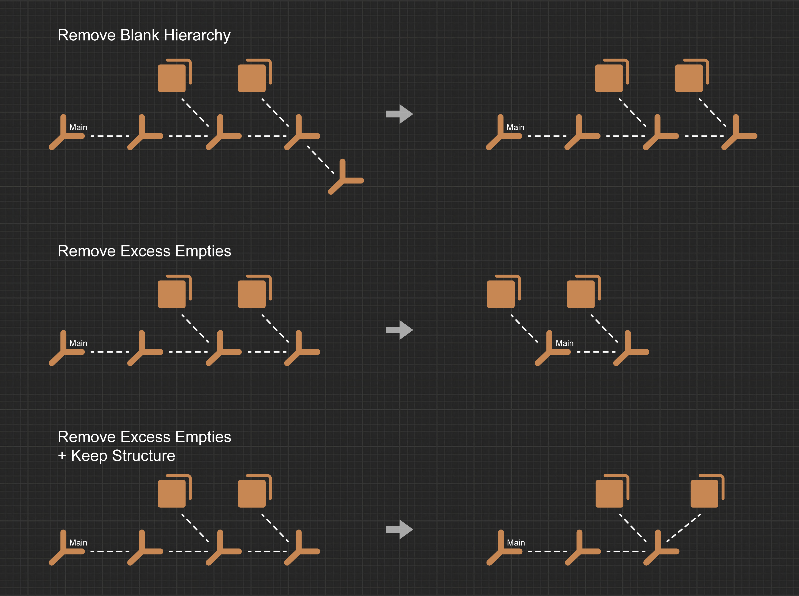

# Empty Tools

  

  

Blender3D addon adds tools for working with Empty objects.  
Helps organize the model structure after exporting from CAD programs.

## Features
- Cleaning the scene from Empty objects
- Converting Empty objects into collections
- Creating an Empty object based on the active object
- Batch resizing Empty objects.

## How it works
- Remove Empty  
<b>Blank Hierarchy.</b> Removes all Empty objects that have no child objects or whose children are all Empty objects, forming an empty branch of the hierarchy.  
<b>Excess Empties.</b> Removes all Empty objects that have exactly one non-Empty child.  
<b>Keep Structure.</b> A mode in which Empty objects are not removed if they have an Empty child, thereby leaving the scene structure untouched.  
<b>Used in Modifiers.</b> A mode in which Empty objects are not removed if they are used in modifiers.  

  

- Convert to Collection  
<b>Current Collection.</b> The new collection is created within the collection where the selected Empty objects are located.  
<b>Keep Parent.</b> The selected Empty object and all its children are moved into the new collection.  

- Create by Active Object  
<b>Align Empty.</b> The created Empty object inherits the orientation of the active object.  
<b>Name from Object.</b> The created Empty object takes the name of the active object. The default name is Group.  

- Empty Size  
Changes the size of all selected Empty objects.  

## Installation
Download the .zip file and follow the [official instructions](https://docs.blender.org/manual/en/latest/editors/preferences/addons.html) for installing addons (Install from Disk).

## Download
Link for download [last release](https://github.com/vgmove/step-tools/releases/download/release_v1.0.0/step_tools.zip).
